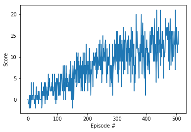

# Project 1: Navigation

The project demonstrates the ability of value-based methods, specifically, [Deep Q-learning](https://storage.googleapis.com/deepmind-media/dqn/DQNNaturePaper.pdf) and its variants, to learn a suitable policy in a model-free Reinforcement Learning setting using a Unity environment, which consists of a continuous state space of 37 dimensions, with the goal to navigate around and collect yellow bananas (reward: +1) while avoiding blue bananas (reward: -1). There are 4 actions to choose from: move left, move right, move forward and move backward. 

The following report is written in four parts:

- **Implementation**
- **Results**
- **Ideas for improvement** 

## Implementation

For this project I used a Deep Q-Network (DQN) model. The aim is to train a policy that tries to
maximize the discounted, cumulative reward Rt0, where Rt0 is also known as the return.
I used PyTorch for the implementation of the DNN. The experience gained by the agent while
acting in the environment is saved in a memory buffer, and a small batch of observations from this
list is randomly selected and used as the input to train the weights of the DNN (i.e., Experience
Replay). At each step, the agent follows an greedy approach to select an action. The value of is
continuously decayed after every episode to gradually focus on exploitation rather than exploration.

  ### Hyperparameters

  There were many hyperparameters involved in the experiment. The value of each of them is given below:

  | Hyperparameter                      | Value |
  | ----------------------------------- | ----- |
  | Replay buffer size                  | 1e5   |
  | Batch size                          | 64    |
  | $\gamma$ (discount factor)          | 0.99  |
  | $\tau$                              | 1e-3  |
  | Learning rate                       | 5e-4  |
  | update interval                     | 4     |
  | Number of episodes                  | 500   |
  | Max number of timesteps per episode | 2000  |
  | Epsilon start                       | 1.0   |
  | Epsilon minimum                     | 0.1   |
  | Epsilon decay                       | 0.995 |

## Results:
  The result of the Deep Q-Network is as below image, which is expected:

 

## Ideas for improvement

- Using Prioritized Replay ([paper](https://arxiv.org/abs/1511.05952)) showed a massive improvement over Double DQNs for Atari games. It is expected that it'll lead to an improved performance here too.
- Other improvements to the original DQN algorithms that were briefly mentioned in the course could be  potentially beneficial too: learning from [multi-step bootstrap targets](https://arxiv.org/abs/1602.01783) , [Distributional DQN](https://arxiv.org/abs/1707.06887), [Noisy DQN](https://arxiv.org/abs/1706.10295)
- Hyperparameter search for both Double DQNs and Dueling Double DQNs should lead to better performance too.